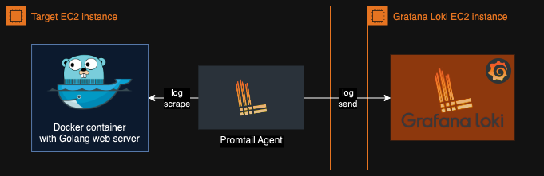
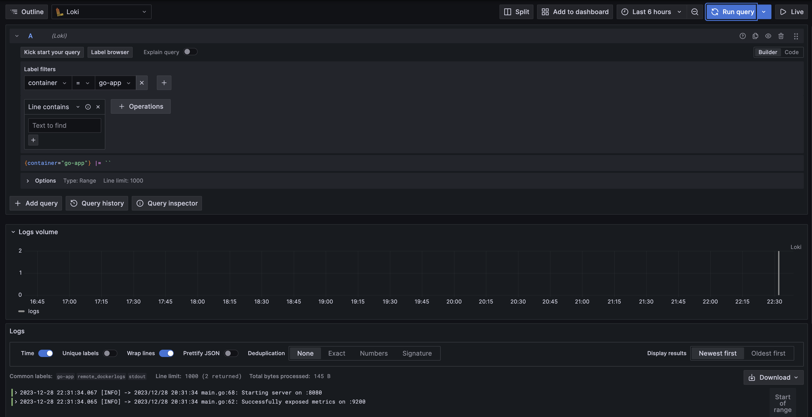

---
# Setting up log collection and visualization with Grafana Loki

## Overview
This documentation outlines the key points that will be useful in the process of implementing the task of `collecting and visualizing logs from a remote web server running in a docker container using Grafana Loki and the Promtail agent`.

## Prerequisites
To reproduce this project in your own environment you'll need:
- AWS free tier account
- `Terraform` to provision AWS infrastructure
- `Ansible` for application deployment and configuration
- `Docker` to build an application image from Dockerfile
- `Golang or any other language` to develop simple web server application with logs

To be able to provision AWS infrastructure with Terraform you'll need:
- to create corresponding IAM user with administrative rights in AWS Management Console
- to run `aws configure` command with use of created IAM credentials

Also, you'll need to create key-pairs manually to ensure secure SSH access to resources.
Your keys (`key-name.pem`) will be automatically downloaded on your PC after creation. 

***You need to place them in the project directory under `keys` folder***.

## Project architecture overview
The resulting architecture of the project is as follows:

As you can see, two AWS EC2 instances are used for logging purposes. One of them is the target where the application whose logs we need to collect is running, and the other is the log collector and visualizer.

## Steps to reproduce

### Terraform configuration
First of all we need to provision our infrastructure. For that, the following terraform configuration been used:
- `providers.tf`:
```hcl
  terraform {
    required_version = ">= 1.2.0"

    required_providers {
      aws = {
        source  = "hashicorp/aws"
        version = "~> 4.16"
      }
    }
  }

  provider "aws" {
    region = "eu-north-1"
  }
```
- `main.tf`:
```hcl
  # ===========EC2 instances creation===========
  resource "aws_instance" "ec2_docker" {
    ami                    = var.ec2_ami
    instance_type          = var.ec2_type
    vpc_security_group_ids = [aws_security_group.ec2_target_sg.id]
    key_name               = data.aws_key_pair.ec2_kp.key_name
    iam_instance_profile   = aws_iam_instance_profile.docker_profile.name
    tags = {
      Name = var.docker_ec2_name
    }
  }

  resource "aws_instance" "ec2_loki" {
    ami                    = var.ec2_ami
    instance_type          = var.ec2_type
    vpc_security_group_ids = [aws_security_group.ec2_loki_sg.id]
    key_name               = data.aws_key_pair.ec2_kp.key_name
    tags = {
      Name = var.loki_ec2_name
    }
  }

  # ===========SSM parameter creation to use in promtail config===========
  resource "aws_ssm_parameter" "loki_client_address" {
    name        = var.loki_ssm_name
    description = "Grafana Loki machine address"
    type        = "SecureString"
    value       = aws_instance.ec2_loki.public_ip
  }
```
- `security.tf`:
```hcl
  # ===========SSH key-pair data source===========
  data "aws_key_pair" "ec2_kp" {
    filter {
      name   = "tag:Purpose"
      values = ["onboarding"]
    }
  }

  # ===========Security groups for monitoring===========
  resource "aws_security_group" "ec2_target_sg" {
    name = "Monitoring Target EC2 Security Group"

    dynamic "ingress" {
      for_each = var.docker_sg_port_list
      content {
        from_port   = ingress.value
        to_port     = ingress.value
        protocol    = "tcp"
        cidr_blocks = ["0.0.0.0/0"]
      }
    }

    egress {
      from_port   = 0
      to_port     = 0
      protocol    = "-1"
      cidr_blocks = ["0.0.0.0/0"]
    }
  }

  resource "aws_security_group" "ec2_loki_sg" {
    name = "Grafana Loki EC2 Security Group"

    dynamic "ingress" {
      for_each = var.loki_sg_port_list
      content {
        from_port   = ingress.value
        to_port     = ingress.value
        protocol    = "tcp"
        cidr_blocks = ["0.0.0.0/0"]
      }
    }

    egress {
      from_port   = 0
      to_port     = 0
      protocol    = "-1"
      cidr_blocks = ["0.0.0.0/0"]
    }
  }

  # ===========IAM role for ECR pulling===========
  resource "aws_iam_role" "ecr_role" {
    name = var.docker_role_name

    assume_role_policy = <<EOF
  {
    "Version": "2012-10-17",
    "Statement": [
      {
        "Effect": "Allow",
        "Principal": {
          "Service": "ec2.amazonaws.com"
        },
        "Action": "sts:AssumeRole"
      }
    ]
  }
  EOF
  }

  resource "aws_iam_role_policy_attachment" "docker_policy_attachment" {
    role       = aws_iam_role.ecr_role.name
    policy_arn = var.docker_policy_arn
  }

  resource "aws_iam_instance_profile" "docker_profile" {
    name = var.docker_profile_name
    role = aws_iam_role.ecr_role.name
  }
```
- `variables.tf`:
```hcl
  # ===========Ubuntu AMI===========
  variable "ec2_ami" {
    default = "ami-07ec4220c92589b40"
  }

  variable "ec2_type" {
    default = "t3.micro"
  }

  # ===========Names for instances===========
  variable "docker_ec2_name" {
    default = "target-docker"
  }

  variable "loki_ec2_name" {
    default = "grafana-loki"
  }

  # ===========Allowed port lists===========
  variable "docker_sg_port_list" {
    default = [22, 80]
  }

  variable "loki_sg_port_list" {
    default = [22, 3000, 3100]
  }

  # ===========IAM vars===========
  variable "docker_role_name" {
    default = "DockerECRAccessRole"
  }

  variable "docker_policy_arn" {
    default = "arn:aws:iam::aws:policy/AmazonEC2ContainerRegistryReadOnly"
  }

  variable "docker_profile_name" {
    default = "docker_profile"
  }

  # ===========SSM var===========
  variable "loki_ssm_name" {
    default = "LokiClientAddress"
  }
```

To apply above config you need to navigate to the [`root project directory`](./) and run such commands:
```bash
  terraform init
```
```bash
  terraform apply
```
After that all needed AWS infrastructure will be up and running.

---
### Docker image
Now we need to build our docker image from the [`Dockerfile`](./server/Dockerfile) and to push it to `Amazon Elastic Container Registry`. 

To do so:
- Navigate to the [`server`](./server/) directory where our Dockerfile resides and run:
```bash
    docker build -t <your.amazon.ecr/uri> .
```
That command will build an app image and tag it with your ECR repository URI for further push.
- Log in to ECR with:
```bash
    aws ecr get-login-password --region <your-aws-region> | docker login --username AWS --password-stdin <your.amazon.ecr>
```
- Push your image to the registry:
```bash
    docker push <your.amazon.ecr/uri>
```

---
### Services deployment
It's time to deploy the necessary services on our ready-made EC2 instances. For this purpose, we use two Ansible playbooks:
- [`Docker playbook`](./ansible/docker/):
```yml
  ---
  - hosts: tag_Name_target_docker           # host, defined in dynamic inventory
    remote_user: ubuntu                     # remote user to login with
    become: yes                             # become root
    roles:
      - roles/docker-install                # role, that installs docker on the machine
      - roles/go-app-container              # role, that creates and runs docker container with go application
      - roles/promtail-install              # role, that installs promtail
```
- [`Grafana Loki playbook`](./ansible/loki/):
```yml
  ---
  - hosts: tag_Name_grafana_loki          # host from dynamic inventory
    remote_user: ubuntu                   # target machine username
    become: yes                           # sudo
    roles:
      - roles/loki-install                # role, that installs loki
      - roles/grafana-install             # role, that installs grafana
```
To automatically detect target hosts, we use [`aws_ec2 dynamic inventory`](./ansible/aws_ec2.yml), that can detect amazon instances by its tags:
```yml
  ---
  plugin: aws_ec2
  aws_profile: ansible
  filters:
    tag:Name:
      - target-docker
      - grafana-loki
    instance-state-name : running
  keyed_groups:
    - key: tags
      prefix: tag
```

To run those playbooks you need to navigate to [`ansible`](./ansible/) directory and run such commands:
```bash
  ansible-playbook ./docker/playbook.yml
```
```bash
  ansible-playbook ./loki/playbook.yml
```

## Logging configuration
As been said before, we need to collect logs from an application that runs in a docker container. To do so, we install Promtail agent on the same EC2 via Ansible playbook. 

Here's promtail configuration [`jinja template`](./ansible/docker/roles/promtail-install/templates/promtail-config.j2):
```yml
  server:
    http_listen_port: 9080
    grpc_listen_port: 0

  positions:
    filename: /etc/promtail/positions.yaml

  clients:
    - url: http://{{ loki_client_address }}:3100/loki/api/v1/push

  scrape_configs:
  - job_name: system
    static_configs:
    - targets:
        - localhost
      labels:
        job: remote_varlogs
        __path__: /var/log/*log

  - job_name: docker
    docker_sd_configs:
      - host: unix:///var/run/docker.sock
        refresh_interval: 5s
        filters:
          - name: label
            values: ["logging=promtail"]
    relabel_configs:
      - source_labels: ['__meta_docker_container_name']
        regex: '/(.*)'
        target_label: 'container'
      - source_labels: ['__meta_docker_container_log_stream']
        target_label: 'logstream'
      - source_labels: ['__meta_docker_container_label_logging_jobname']
        target_label: 'job'
```
This configuration allows collecting system logs, logs from docker containers by the appropriate labels, as well as filtering the data that will be visualized in the `Grafana Dashboard` (by job, container name, etc).

On the other EC2 we install Grafana and Loki. To connect Grafana with Loki we need to configure corresponding [`datasource`](./ansible/loki/roles/grafana-install/templates/data-source.j2):
```yml
  apiVersion: 1

  datasources:
    - name: Loki
      type: loki
      access: proxy
      url: http://localhost:3100
      jsonData:
        maxLines: 1000
      isDefault: true
```

## Result
As a result, we have configured log collection with `Promtail` and `Grafana Loki` for simple `Golang application running in Docker container`.

We can see a visible result on the Grafana Dashboard as follows:
