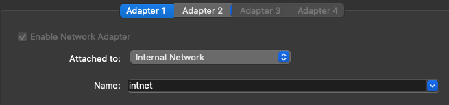

  # Traffic redirection documentation  
  
  ## Overview  
  This documentation outlines a method to solve task of *traffic redirection from port 81 in one subnetwork to port 80 in another subnetwork (Using Centos/RHEL 6)*.

  In this solution I used **Oracle VIrtualBox** as virtualization tool, in which **two CentOS 7 VMs** been created.
  
  The main focus was on network configuration of these VMs and appropriate iptables rules.
  
  ## Network structure
  General workflow is as follows:
  

  So, we need to ensure access from the host network (***192.168.0.0/24***) to Apache Web Server hosted on the VM2 (***10.10.10.2:80***) in internal network through redirection from VM1 (***10.10.10.1:81***), which will act like router and default gateway.

  ## Step-by-step reproduction
  First of all we need to setup VM1 and VM2. I used official CentOS iso image from https://www.centos.org/download/ .

  #### Here's VirtualBox network adapter settings for VM1:
  
  
  
  
  
  #### And for VM2:
  
  

  **!** you will need to temporary enable bridged adapter in VM2 to be able to update packages and install httpd.

  After you successfully installed both virtual machines, you should update them:
  
    sudo yum update -y

  #### After that we have to configure static ip addresses for our internal adapters on both machines.

  Open ***/etc/sysconfig/network-scripts/ifcfg-{name of your internal interface}*** and edit them to look as follows:

  For VM1:
  
  

  For VM2:
  
  

  After that restart configured interfaces by:

    sudo ifdown {interface name}

    sudo ifup {interface name}

  Then test connection between VM1 and VM2 in internal network with:

    ping {destination IP}

  #### Next goes installation of httpd server on VM2:

    sudo yum install httpd
    
    sudo service httpd start

  You can check if server is up by running:

    sudo service httpd status

  #### If everything OK, let's move to iptables configuration.
  We need to allow traffic on port 80 on VM2 to be able to reach our web server from other machines.

  To do so let's create simple rule on VM2 by running:

    iptables -I INPUT -p tcp --dport 80 -j ACCEPT

  **!** after system restart you'll need to run this command again.

  Now we can reach our server from VM1. You can check that by running:

    curl http://10.10.10.2:80

  You will get raw html output of a web-page.

  #### Now, the main part - iptables rules to redirect traffic from host network to our web-server.

  For that we need to write a bash script on VM1 to simply execute some rules after system startup:

    #/bin/sh

    # to enable traffic forwarding
    sysctl -w net.ipv4.ip_forward=1

    # to clear other iptables rules
    iptables -F

    # rule to allow traffic forwarding on port 80 from host network to internal:
    iptables -A FORWARD -p tcp --dport 80 -i enp0s3 -o enp0s8 -j ACCEPT

    # rule to redirect traffic from VM1 port 81 to VM2 port 80:
    iptables -t nat -A PREROUTING -p tcp -i enp0s3 --dport 81 -j DNAT --to-destination 10.10.10.2:80
    iptables -L   # to print all active rules

    # enp0s3 --> VM1 host network interface
    # enp0s8 --> VM1 internal network interface

The last step is to execute this script:

    chmod +x iptables.sh

    ./iptables.sh

#### After that we can get access to internal web-server from our host machine by entering VM1 host IP address (192.168.0.111 in my case) and specifying port 81:

